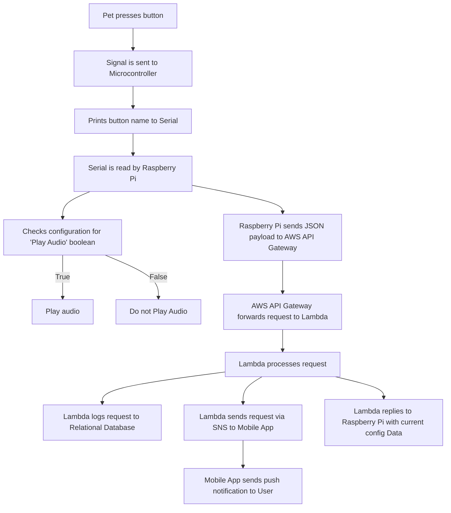

# Personal Pet Buttons - Backend (AWS)

SAM Configuration and code for the Backend buttons

## High-Level flowchart

```mermaid
flowchart TD
a[Pet presses button] --> b[Signal is sent to Microcontroller] --> c[Prints button name to Serial] --> d[Serial is read by Raspberry Pi] -->
e[Raspberry Pi sends JSON payload to AWS API Gateway] 
d --> da[Checks configuration for 'Play Audio' boolean]
da --True--> db[Play audio]
da --False--> dc[Do not Play Audio]
e --> f[AWS API Gateway forwards request to Lambda]
f --> g[Lambda processes request]
g --> h[Lambda logs request to Relational Database]
g --> i[Lambda sends request via SNS to Mobile App] --> ia[Mobile App sends push notification to User]
g --> j[Lambda replies to Raspberry Pi with current config Data]
```